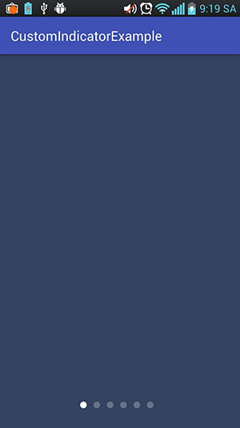

# Indicator ViewPager
Indicator ViewPager is a library that allows you to create a indicator of viewpager with 3 style.

  
  
  
---

# Table of Contents

1. [Gradle Dependency](https://github.com/jd-alexander/LikeButton#gradle-dependency)
   1. [Repository](https://github.com/jd-alexander/LikeButton#repository)
   2. [Dependency](https://github.com/jd-alexander/LikeButton#dependency)
2. [Basic Usage](https://github.com/jd-alexander/LikeButton#basic-usage)
   1. [Like Button XML](https://github.com/jd-alexander/LikeButton#like-button-xml)
   2. [Attributes](https://github.com/jd-alexander/LikeButton#attributes)
3. [Button State](https://github.com/jd-alexander/LikeButton#button-state)
4. [Like Event Listener](https://github.com/jd-alexander/LikeButton#like-event-listener)
5. [Icon Types](https://github.com/jd-alexander/LikeButton#icon-types)
6. [Icon Size](https://github.com/jd-alexander/LikeButton#icon-size)
7. [Custom Icons](https://github.com/jd-alexander/LikeButton#custom-icons)
8. [Circle Color Config](https://github.com/jd-alexander/LikeButton#circle-color-config)
9. [Dots Color Config](https://github.com/jd-alexander/LikeButton#dots-color-config)
10. [Animation Size](https://github.com/jd-alexander/LikeButton#animation-size)
11. [Inspiration](https://github.com/jd-alexander/LikeButton#inspiration)
12. [Contribution](https://github.com/jd-alexander/LikeButton#contribution)
13. [License](https://github.com/jd-alexander/LikeButton#license)

   
---

# Gradle Dependency


#### Repository

Add this in your root `build.gradle` file (**not** your module `build.gradle` file):

```gradle
allprojects {
	repositories {
		...
		maven { url 'https://jitpack.io' }
	}
}
```

#### Dependency

Add this to your module's `build.gradle` file:

```gradle
dependencies {
	  compile 'com.github.ATHBK:IndicatorView:v1.0'
}
```

---

# Basic Usage

#### IndicatorView XML

To use this IndicatorView in your layout simply copy and paste the xml below. This provides the default indicator. 

```xml
<com.athbk.indicatorview.IndicatorView
        android:layout_width="match_parent"
        android:layout_height="wrap_content"
        android:layout_gravity="bottom"
        android:layout_marginBottom="30dp"
        android:id="@+id/indicator"
	app:indi_color_selected="#ffffff"
	app:indi_color_unselected="#40ffffff"/>
```
#### Indicator Attr 

There are several other attributes that can be used to configure the button's behaviour and appearance. They are shown below and will be explained in the sections that follow long with their java counterparts.

```xml
 	....
	app:indi_color_selected="#ffffff"
	app:indi_color_unselected="#40ffffff"
```
---

# Init from Java

#### Java

If you would like to set the icon via Java then simply call the set icon method on the button. 

```java
	ViewPagerAdapter adapter = new ViewPagerAdapter(6);
        viewPager.setAdapter(adapter);
        indicator.setType(StyleIndicator.CIRCLE_STYLE_2);
        indicator.setViewPager(viewPager);
```
** Note: You must declare type first, then setViewPager.

** 3 style in class StyleIndicator.

StyleIndicator.CIRCLE_STYLE_1
StyleIndicator.CIRCLE_STYLE_2
StyleIndicator.SHAPE

---
# License

    Copyright 2017 ATHBK

    Licensed under the Apache License, Version 2.0 (the "License");
    you may not use this file except in compliance with the License.
    You may obtain a copy of the License at

       http://www.apache.org/licenses/LICENSE-2.0

    Unless required by applicable law or agreed to in writing, software
    distributed under the License is distributed on an "AS IS" BASIS,
    WITHOUT WARRANTIES OR CONDITIONS OF ANY KIND, either express or implied.
    See the License for the specific language governing permissions and
    limitations under the License.
